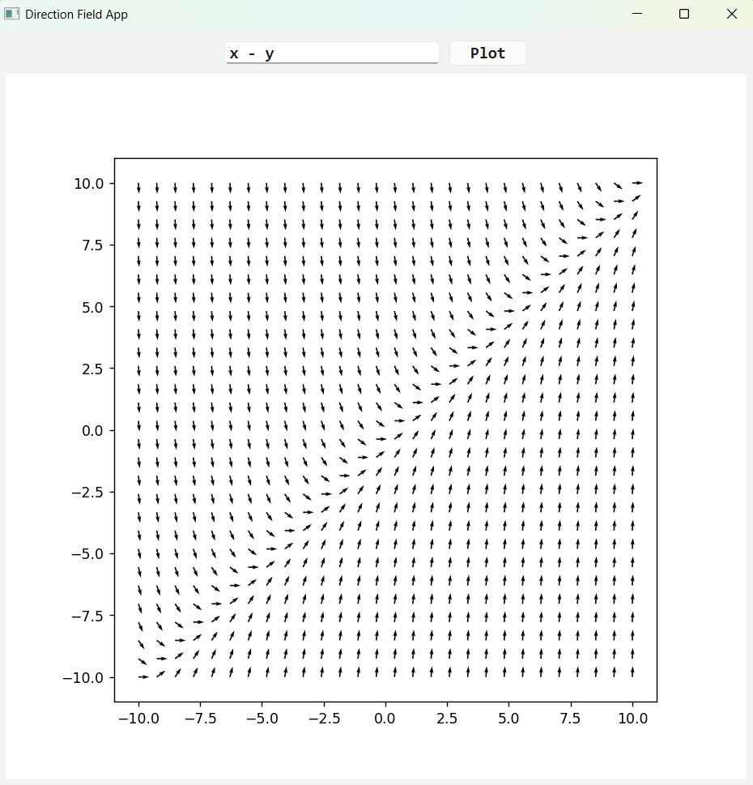

## Overview

This is a desktop application that visualizes the direction field (slope field) of first-order differential equations of the form: **dy/dx = f(x, y)**

The user can input a function f(x, y), and the app dynamically renders the corresponding direction field.
You can try some of the following equations: 
- **-x / y**
- **y - y\*\*3**
- **sin(x * y)**
- **x*y**

The mathematical significance and interpretative value of sketching direction fields are discussed in detail in the accompanying document: 

## Install
Click here to download and install: [Download](https://github.com/kieran-lucas/beginner_newton-direction-field/releases/download/v1.0.0/direction_field.exe)

## Design
The overall layout of the application is shown below:

  

